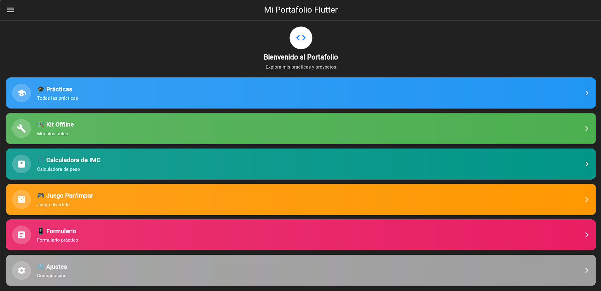

# Mi Portafolio Flutter

##  Aplicación Flutter - Prácticas y Módulos

Esta aplicación se desarrolló como parte del aprendizaje de **Flutter** y tiene como objetivo **demostrar la adquisición de habilidades prácticas** mediante la creación de interfaces interactivas y módulos funcionales. La app combina **prácticas de programación**, **módulos offline** y **herramientas de utilidad**, todo en una estructura organizada y visualmente atractiva.

Su diseño busca no solo mostrar resultados, sino también **permitir al usuario interactuar con los elementos**, explorar funcionalidades y entender la lógica detrás de cada práctica o módulo.

---

##  Cómo ejecutar

Para probar la aplicación en tu entorno local, sigue estos pasos:

1. Abre una **Terminal** en tu proyecto.
2. Ejecuta el siguiente comando para descargar dependencias:
   flutter pub get
3. Luego inicia la aplicación:
   flutter run
   Durante la ejecución, se te pedirá seleccionar la plataforma en la que deseas correr el programa.
---

### Navegación Principal

* **Inicio (Hub)**
  La pantalla de inicio funciona como un **centro de navegación**. Aquí se encuentran tarjetas de acceso rápido a todas las secciones de la aplicación, incluyendo prácticas, módulos offline y ajustes. Cada tarjeta tiene un **color distintivo y un icono representativo**, lo que facilita la identificación visual y mejora la experiencia de usuario.
  Por ejemplo, al tocar la tarjeta de "Prácticas", el usuario es dirigido directamente a la lista completa de ejercicios realizados.
---

### Mis Prácticas

Esta sección concentra todas las **prácticas realizadas durante el curso**, permitiendo ver cómo ha evolucionado el aprendizaje en Flutter.

* **Índice de Prácticas**
  Lista organizada de todas las prácticas, funcionando como un **registro de progreso**. Esto permite revisar rápidamente qué ejercicios se han completado y cuáles faltan.
  

* **Práctica 3 - Hola Mundo**
  Muestra **10 mensajes interactivos** en pantalla, lo que introduce al usuario en la manipulación de widgets de texto y la interacción básica en Flutter. Es la base para entender cómo mostrar información dinámica en una app.
  
  

* **Práctica 4 - Contador**
  Implementa un contador **dinámico** que puede incrementar o decrementar valores mediante botones. Ayuda a entneder la **gestión de estados**, la actualización instantánea de la UI y cómo manejar eventos del usuario ademas contiene tres botones uno para agregar, uno para reiniciar y uno para agregar multiples.
  
  

* **Práctica 5 - Piedra, Papel, Tijera**
  Juego interactivo contra la CPU. Permite desarrollar un juego muy antiguo e universal con esto ayuda aentneder algoritmos de azar.
  

* **Formulario de Práctica**
  Un formulario completo con validaciones en tiempo real, selección de género, nivel educativo, fecha de nacimiento y aceptación de términos. Permite **almacenar registros**, mostrarlos en una lista y eliminar elementos si es necesario.
  
  

---

### Kit Offline - Módulos

Estos módulos son **herramientas funcionales**, diseñadas para demostrar cómo crear aplicaciones prácticas que funcionen sin conexión a internet.

* **Calculadora de peso (IMC)**
  Calculadora que permite al usuario ingresar su peso y altura para obtener su **Índice de Masa Corporal (IMC)**. Este módulo es útil, mostrando valores dinámicos según los datos ingresados.
  

* **Notas Rápidas**
  Módulo de CRUD completo: crear, leer, actualizar y eliminar notas y cómo mantener la información organizada y accesible al usuario.
  
  

* **Galería Local**
  Permite explorar imágenes que están **almacenadas localmente** dentro de la app. Este módulo enseña a manejar recursos internos (`assets`) y a construir interfaces visuales atractivas.

* **Juego Par/Impar**
  Juego donde el usuario compite contra la CPU seleccionando números pares o impares. Es un ejemplo práctico de **lógica condicional, generación de números aleatorios y actualización de UI**.
  

---

###  Configuración

* **Ajustes**
  Sección donde se pueden **personalizar las preferencias de la app**, como colores y temas. En el caso de este proyecto no se logró implementar de manera completa, pero se exploró la estructura necesaria para futuras mejoras.
  

---

###  Aprendizaje Obtenido

Este portafolio **no solo muestra resultados visuales**, sino que también refleja el **proceso de aprendizaje**, la organización de proyectos en Flutter, la interacción entre widgets y la gestión de estados y datos. Cada práctica y módulo representa un **concepto clave aprendido**, que va desde la creación de interfaces básicas hasta aplicaciones funcionales con lógica más compleja, incluyendo **formularios, juegos y módulos de utilidad**.
---